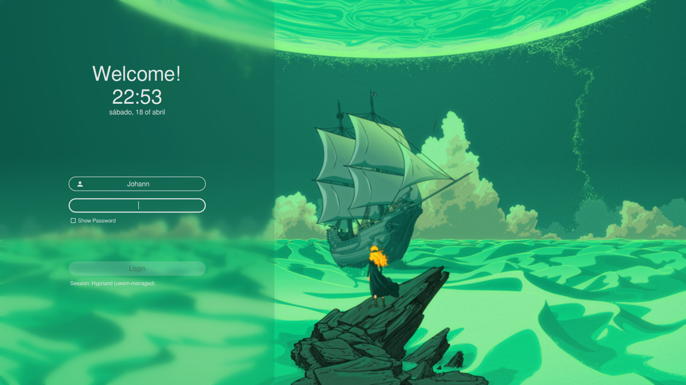
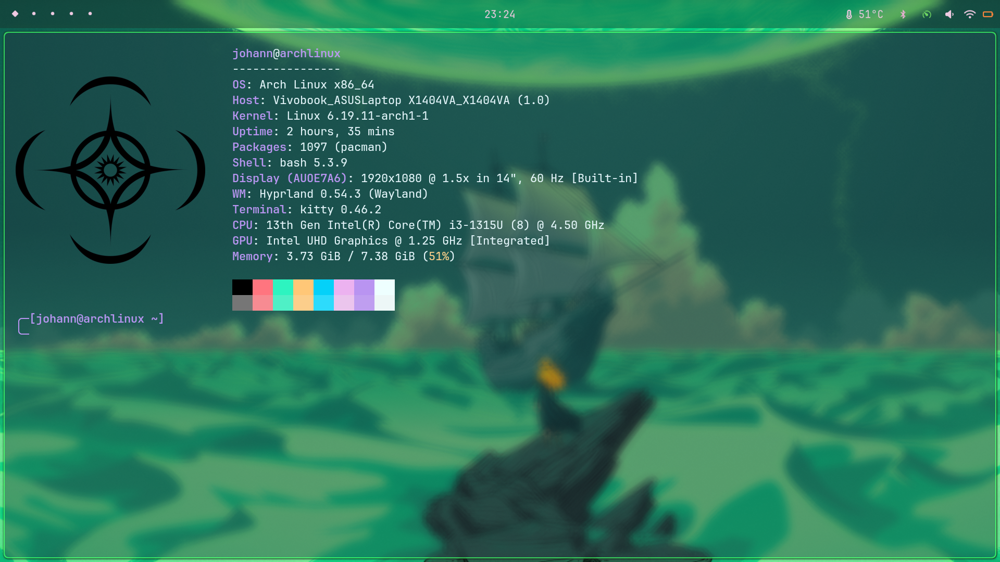
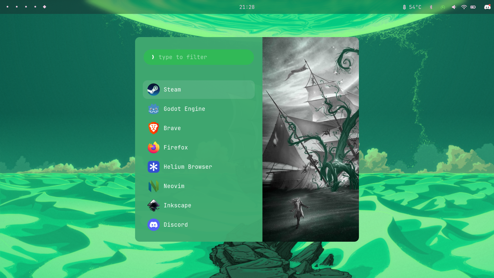

# ArchHyperland-Trees-Emerald-Sea-Ev

Este repositorio contiene mis archivos de configuración personal (dotfiles) para un entorno de escritorio basado en **Hyprland** sobre **Arch Linux**. El tema visual está inspirado en el libro "Trees of the Emerald Sea".

## Características principales
- **Window Manager:** [Hyprland](https://hyprland.org/) (Configuración optimizada y binds personalizados).
- **Barra de estado:** [Waybar](https://github.com/Alexays/Waybar).
- **Terminal:** [Kitty](https://sw.kovidgoyal.net/kitty/).
- **Lanzador de aplicaciones:** [Rofi](https://github.com/davatorium/rofi).
- **Fondo de pantalla:** [Hyprpaper](https://wiki.hypr.land/Hypr-Ecosystem/hyprpaper/).
- **Login Manager:** SDDM con el tema [sugar-dark](https://github.com/MarianArlt/sddm-sugar-dark) modificado.

## Screnshots





## 📦 Requisitos
El repositorio incluye un archivo `pacman.txt` con las dependencias necesarias. Algunas de las aplicaciones clave son:
- `hyprland`, `waybar`, `rofi`, `hyprpaper`.
- `yay` (para paquetes de AUR como `helium-browser-bin`).

## ⚙️ Instalación

> **Advertencia:** Este script modificará archivos en tu directorio `~/.config` y `/etc/`. Se recomienda revisar los scripts antes de ejecutar.

1. **Clona el repositorio:**
   ```bash
   git clone https://github.com/johannfleitas/ArchHyperland-Trees-Emerald-Sea-Ev.git
   cd ArchHyperland-Trees-Emerald-Sea-Ev
   ```

2. **Ejecuta el script de instalación:**
   El script `install.sh` se encarga de instalar los paquetes de pacman, configurar `yay`, copiar los archivos de configuración y establecer los wallpapers.
   ```bash
   chmod +x install.sh
   ./install.sh
   ```

3. **Mantenimiento (Opcional):**
   Si realizas cambios y quieres respaldarlos rápidamente, puedes usar el script incluido:
   En caso de usarlo recuerda create un repositorio antes a donde subir los cambios una vez hecho solo mueve `./backupAndPush.sh` al mismo
   No olvide hacer `chmod +x backupAndPush.sh` para habilitar el script, ejecutalo
   ```bash
   ./backupAndPush.sh
   ```

## 📂 Estructura del Proyecto
- `/configs`: Contiene las carpetas de configuración para `hyprland`, `waybar`, `alacritty`, etc.
- `/wallpapers`: Fondos de pantalla incluidos en el tema.
- `/home_files`: Contiene el dotfile de bash.
- `/root`: Archivos de configuración del sistema (como `pacman.conf` y temas de `sddm`).
- `install.sh`: Script automatizado de despliegue.

## 🎨 Créditos
- Desarrollado por [@johannfleitas](https://github.com/johannfleitas).
- Tema SDDM: "Sugar-Dark" [MarianArlt](https://github.com/MarianArlt/sddm-sugar-dark).
- Tema visual: Emerald Sea Edition.
